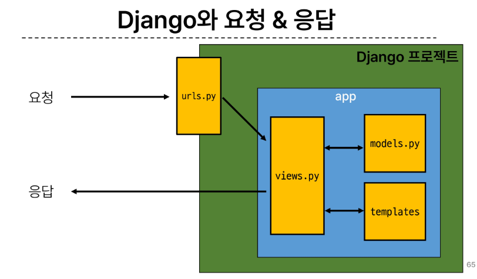
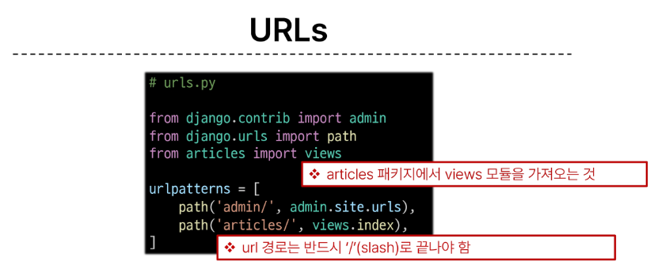
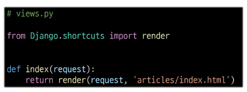
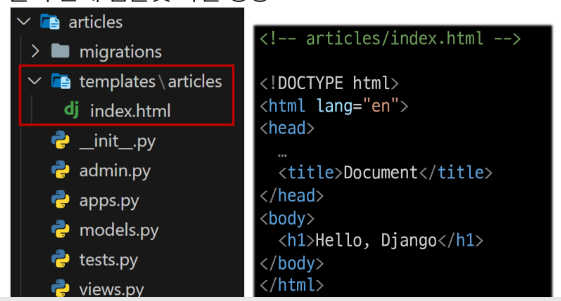
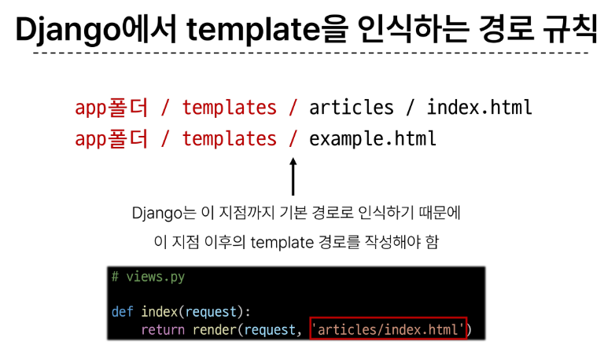
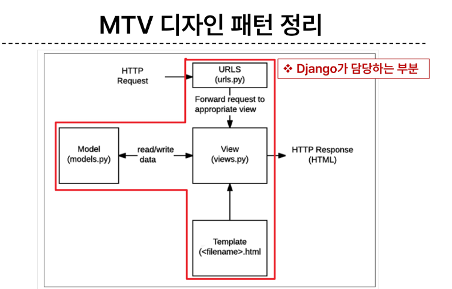
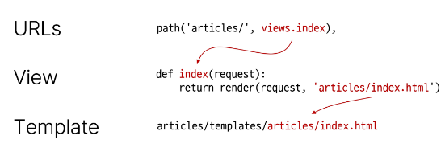
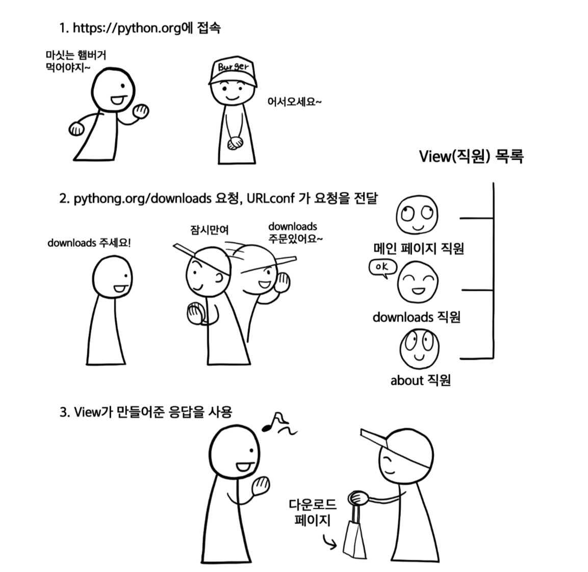

# Django 0912 온라인 수업 내용

### 클라이언트 / 서버

#### 웹의 동작 방식 :
<dl>
<dt><em>클라이언트 - 서버 구조</em></dt>
<dd>클라이언트 : 서비스를 요청하는 주체 (웹 사용자의 인터넷이 연결된 장치, 웹 브라우저)</dd>
<dd>서버 : 클라이언트의 요청에 응답하는 주체 (웹 페이지, 앱을 저장하는 컴퓨터)</dd>

<dt><em>우리가 웹 페이지를 보는 과정 : </em></dt>
<dd>1. 웹 브라우저 (클라이언트) 에서 'google.com'을 입력</dd>
<dd>2. 브라우저는 인터넷에 연결된 전세계 어딘가에 있는 구글 컴퓨터에게 'Google 홈페이지.html'파일을 달라고 요청</dd>
<dd>3. 요청을 받은 구글 컴퓨터는 데이터베이스에서 'google홈페이지.html' 파일을 찾아 응답</dd>
<dd>4. 전달받은 파일을 웹브라우저가 사람이 볼 수 있도록 해석해주면서 사용자는 구글의 메인 페이지를 보게 됨</dd>

<dt><em>가상환경</em></dt>
<dd>: 패키지들을 격리해서 관리할 수 있는 독립적인 실행 환경</dd>
<strong> 사용하는 이유 : </strong>
<dd> 1. 의존성 관리 :  라이브러리 및 패키지를 각 프로젝트마다 독립적으로 사용 가능 </dd>
<dd> 2. 팀 프로젝트 협업 :  모든 팀원이 동일한 환경과 의존성 위에서 작업하여 버전간 충돌을 방지 </dd>

### 가상환경 venv :
<dl>
<dt>
<dd>1. 가상환경 venv 생성 :  python -m venv venv</dd>
<dd>2. 가상환경 활성화 : source venv/Scripts/activate</dd>
<dd>3. 환경에 설치된 패키지 목록 확인 : pip list</dd>
<dd>4. 의존성 패키지 목록 생성 : pip freeze > requirements.txt </dd>
<dd>5. Django 프로젝트 생성 : django-admin startproject firstpjt . </dd>
<dd>6. Django 서버 실행 : python manage.py runserver </dd>

### Django 프로젝트와 앱 :
<dl>
<dt>
<dd>1. 앱 생성 :  python manage.py startapp articles</dd>
<dd>2. 앱 등록 : <strong>반드시 앱을 생성 한 후 등록해야함 / 등록 후 생성은 불가능</strong></dd>

### Django 디자인 패턴 :
<dl>
<dt>
<dd>소프트웨어 설계에서 발생하는 문제를 해결하기 위한 일반적인 해결책 ( 공통적인 문제를 해결하는데 쓰이는 형식화 된 관행 )</dd>
<dd>MVC 디자인 패턴 (MODEL, VIEW , CONTROLLER ) : 애플리케이션을 구조화하는 대표적인 패턴 ( 데이터, 사용자 인터페이스, 비즈니스 로직을 분리 )</dd>
<dd>MTV 디자인 패턴 (MODEL, TEMPLATE , VIEW) : Django 에서 애플리케이션을 구조화하는 패턴</dd>

## 프로젝트 구조와 앱 구조

### 프로젝트 구조 
- settings. py : 프로젝트와 모든 설정을 관리
- urls.py : URL과 이에 해당하는 적절한 views를 연결
- __init__.py : 해당 폴더를 패키지로 인식하도록 설정
- asgi.py : 비동기식 웹 서버와의 연결 관련 설정
- wsgi.py : 웹 서버와의 연결 관련 설정
- manage.py : Django 프로젝트와 다양한 방법으로 상호작용 하는 커맨드라인 유틸리티

### 앱 구조
- admin.py : 관리자용 페이지 설정
- models.py : DB와 관련된 model을 정의 / MTV 패턴의 M
- views.py : HTTP 요청을 처리하고 해당 요청에 대한 응답을 반환 / MTV 패턴의 V
- app.py : 앱의 정보가 작성된 곳
- tests.py : 프로젝트 테스트 코드를 작성하는 곳

## 요청과 응답

### URLS

- articles로 요청이 왔을 때 views 모듈의 index 뷰 함수를 호출

### View

-  def index() <--안에 request 넣어주기 
- 특정 경로에 있는 template 과 request 객체를 결합해 응답 객체를 반환하는 index view 함수 정의

### Template

1. articles 앱 안에 templates 폴더 생성 
2. templates 폴더 안에 articles 폴더 생성
3. articles 폴더 안에 템플릿 파일 생성

*****************************

# Django 0912 오프라인 수업 내용

## 개발자의 마인드로 항상 왜? 라는 질문을 던져보기
1. Django 를 배웠는데 프레임워크는 뭘까?
    - 프레임 워크란, 반복적으로 사용되는 특정 기술을 모아 같은 기능을 하는 코드들을 말한다. 이는 웹 애플리케이션을 빠르게 개발 할 수 있도록 도와주는 도구이다.
2. 가상환경은 왜 만들고, 의존성 파일은 왜 만들까?
    - 가상환경은 일단 팁 프로젝트 협업을 위해서 많이 쓰인다 ; 모든 팀원이 동일한 환경과 의존성 위에서 작업하게 되어 버전간의 충돌을 방지할 수 있기 때문이다. 또, 의존성 관리 때문에 쓰인다 ; 라이브러리 및 패키지를 각 프로젝트마다 독립적으로 사용 할 수 있기 때문이다.
3. urls.py ,settings.py, views.py 의 각각의 역할은 무엇인가?
    - urls.py 를 통해 요청을 보내면 여기서 views 모듈의 index view 함수를 호출한다.
    - views.py 는 특정 경로에 있는 template 과 request 객체를 결합해서 응답 객체를 반환하는 index view 함수를 정의한다.
    - MTV (MVC) 패턴과 같은 패턴을 만든 이유는 뭘까?

    - MTV 
    - M : models.py -> 데이터와 관련된 로직
    - T : templates.py -> 보여지는 것 (화면)
    - V : views.py -> 모델과 템플릿과 관련된 로직
    
    
    
4. git 사용 할 때 gitignore 은 왜 필요할까?
    - 햣

*****************************
# Django와 웹사이트의 이해

## Django 는 ? 

- Django 는 파이썬으로 작성된 웹 프레임워크로, 프레임워크란 반복적으로 사용되는 특정 기술을 모아 놓은 도구 상자와 같은 기능(코드 조각)을 말한다. 
- Django 는 웹 프레임워크로써 웹 사이트를 만들기 위해 일반적으로 필요로 하는 기능들을 가지고 있다.
### Django 의 핵심 기능
1. 데이터베이스 관리 (DB) : 데이터베이스에 정보를 저장하고, 불러오기 위한 일관적이며 쉬운 방법을 제공한다.
2. 강력한 관리자 기능 : 약간의 수정만으로 실제 운영되는 서비스에서 사용 할 만한 관리자 페이지를 자동으로 생성해준다
3. 보안 : 다양한 보안 장치를 탑재하고 있다.
4. 다양한 내장기능과 파이썬 확장 기능 : DB 관리 / 이메일 전송 / 언어별 번역 관리 / 로그인 . 회원가입 . 비밀번호 변경 등의 인증 / RSS 피드 . 검색 엔진을 위한 Sitemap 생성 / CSV,PDF 생성 기능

## Django 가 요청에 응답하는 방법 

1. URL로 사용자의 요청이 전달된다.
2. 요청에 응답할 수 있는 함수로 요청을 전달한다.
<dd> URL 설정 (URLconf)은 요청자가 브라우저의 주소 표시줄로 전달한 URL 로부터 어떤 페이지를 요청했는지 구분</dd>

3. View 함수는 요청을 처리한 후, 응답을 되돌려준다.
4. 응답은 요청자의 브라우저로 전달되며, 브라우저는 응답을 해석해서 사용자에게 보여준다.