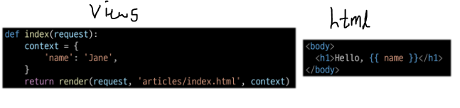
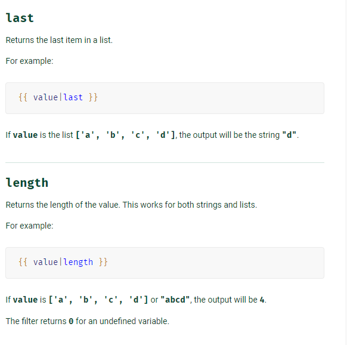
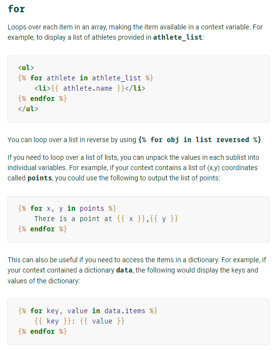
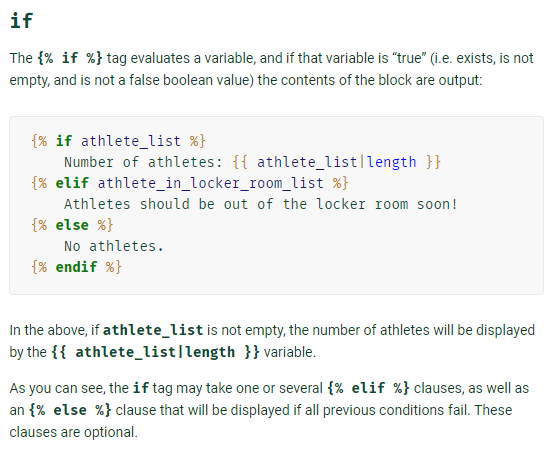
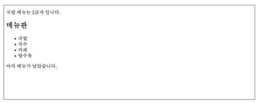
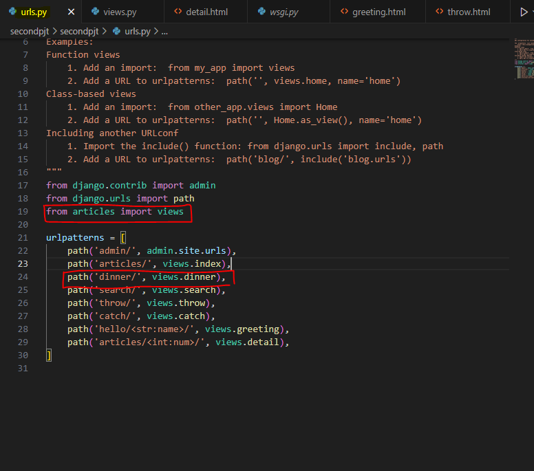
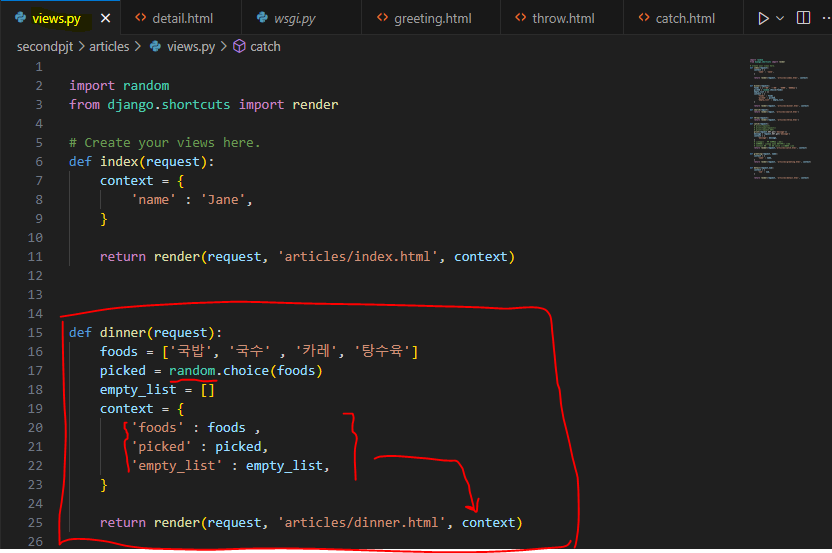
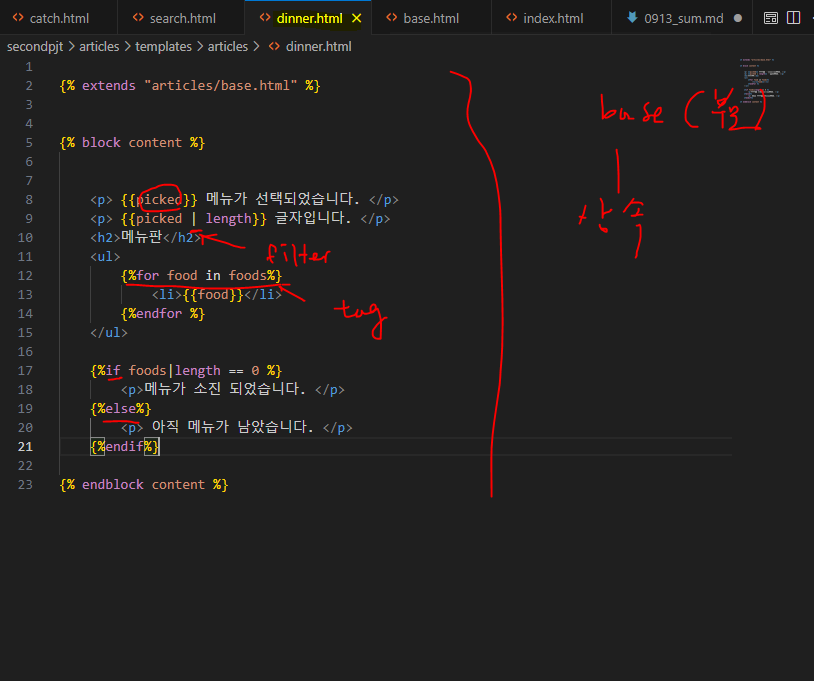
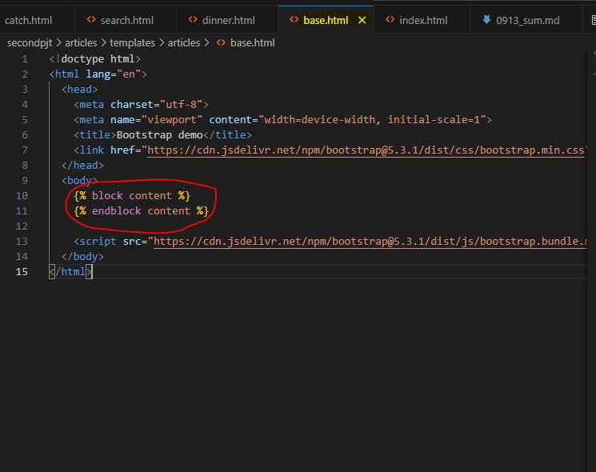

# 0919 온라인 수업 내용 

## INDEX
- Django Template
    - Template system
    - 템플릿 상속
    - HTML form (요청과 상속)
- Django URLs
    - Django URLs
    - 변수와 URL
    - App 과 URL
    - URL 이름 지정
    - URL 이름 공간


### 항상 이런 방식으로 수정 

1. urls.py에서 ' path('catch/', views.catch) ' 이런식으로 views로 path 설정
2. views.py 에서 
```
def catch(request):
    message = request.GET.get('message')
    context = {
        'message': message,
    }
    return render(request,'articles/catch.html', context)
```
이런식으로 함수를 정의하고, return render을 써서 request 를 html 파일로 보냄 (여기서 context 에 원하는 내용을 넣음)

3. articles/templates/에 특정 html파일을 하나 만듬

***

### Template System
```
Django Template Language (DTL) : Template 에서 조건, 반복, 변수 등의 프로그래밍적 기능을 제공하는 시스템
```
#### DTL Syntax
- 1. Variable : 
        <p> - render 함수의 세번째 인자로 딕셔너리 데이터를 이용. 
        <p> - 딕셔너리 key 에 해당하는 문자열이 template 에서 사용 가능한 변수명이 됨
        <p> dot(.)을 사용하여 변수 속성에 접근할 수 있음 
        
- 2. Filters : 
        <p> - 표시할 변수를 수정 할 때 사용
        <p> - chained 가 가능하며, 일부 필터는 인자를 받기도 함.
        <p> - 약 60개의 built-in template filters 를 제공함
        <a href='https://docs.djangoproject.com/en/4.2/ref/templates/builtins/'>
        Built-in template 사이트</a>
        <p>
        예시 : 
        <p>
- 3. Tags : 
        <p> - 반복 또는 논리를 수행하여 제어 흐름을 만듦
        <p> - 일부 태그는 시작과 종료 태그가 필요
        <p> - 약 24개의 built-in template tags 를 제공
        <p><h4>' '<h4>
        <p>
        
        
- 4. Comments:
        <p> - DTL 에서의 주석


***
## DTL 실습 예시


<p>위와 같은 페이지 형식 만들어보기

<p>
1. urls.py 에 
<p> - from articles import views 쓴 후 
<br> - urlpateerns 리스트 안에 path 지정 


<p>
2. views.py 에 
<p> - dinner 함수 정의후, 원하는 key값 contents 안에 저장


<p>
3. dinner.html에 
<p> - tag, filter 등 built-in template filter 등을 이용해서 구현
<p> - 이 때, 같은 내용의 반복을 상속을 통해서 해결 할 수 있다.


****
<h1> 오프라인 수업 내용 </h1>

- 템플릿 상속 + DTL
    - 템플릿 상속을 하는 이유는 무엇일까?
        -  중복을 피하려고
    - HTML 에는 로직이 들어 갈 수 없다고 했는데 DTL은 어떻게 사용할 수 있는가?

- form 태그
    - form 태그에서 query란 무엇일까? 데이터 베이스의 query 와의 차이는 무엇인가 ?
    - GET 방식과 POST 방식의 차이는?

- APP과 URL
    - url mapping은 왜 사용하는 걸까?