# 온라인 수업 내용 복습

### <em> INDEX </em>

- model
- migrations
- admin site

## 1. Model

```
Django Model : DB의 테이블을 정의하고 데이터를 조작할 수 있는 기능들을 제공한다.
```

```
class Article(models.Model):
    title = models.CharField(max_length=10)
    content = models.TextField()
```
- 구조 살펴보기
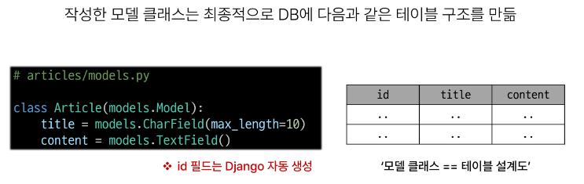
- django.db.models 모듈의 Model이라는 부모 클래스를 상속받고, Model 은 model에 관련된 모든 코드가 이미 작성되어있는 클래스이다.
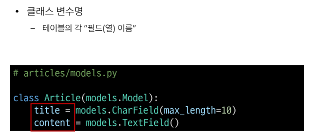
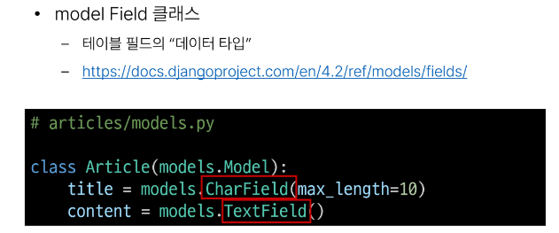
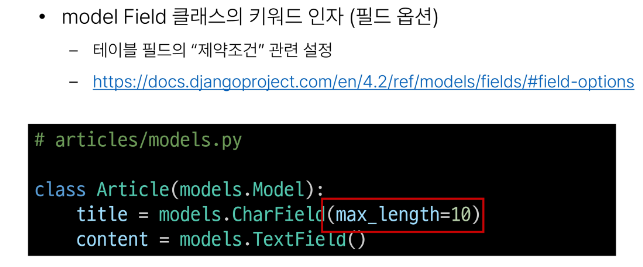

## 2. Migrations

```
model 클래스의 변경사항(필드생성, 수정삭제 등)을 DB에 최종 반영하는 방법
```
1. MODEL CLASS(설계도 초안)
2. MIGRATION 파일(최종 설계도)
3. DB.SQLITE3(DB)
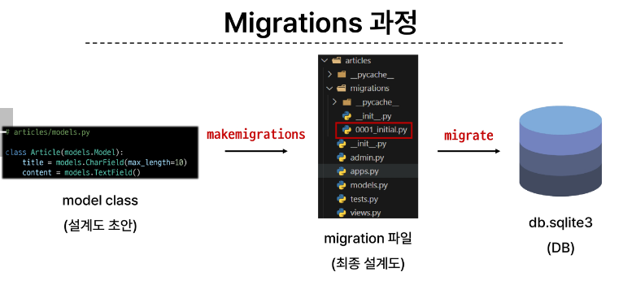

```
$ python manage.py makemigrations
--> model class 를 기반으로 최종설계도(migtration)을 작성

$ python manage.py migrate
--> 최종 설계도를 DB에 전달하여 반영
```

#### <strong> 추가 migrations </strong>

- 이미 생성된 테이블에 필드를 추가해야한다면? 
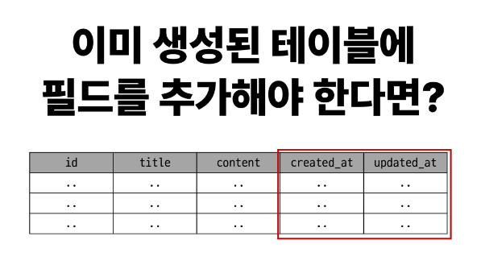

- 추가 모델 필드 작성
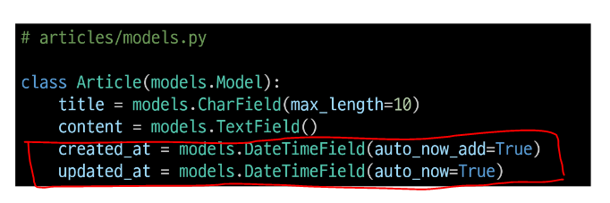

1. 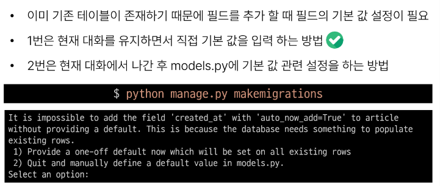 
2. 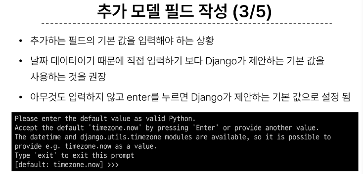 
3. 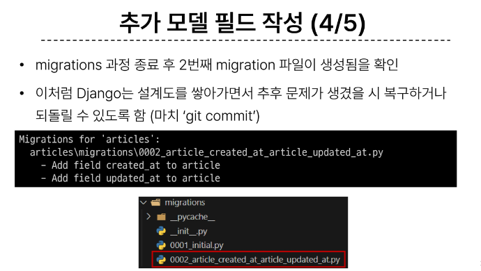 
4. 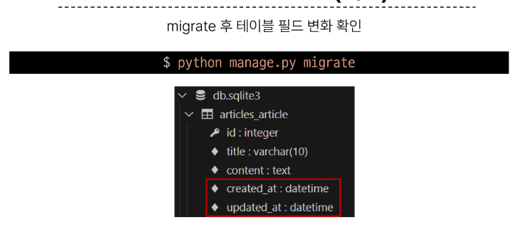 

#### <strong> 추가 Model Field </strong>
```
DB 테이블의 필드(열)을 정의하며, 해당 필드에 저장되는 데이터 타입과 제약조건을 정의
```

- CharField(): 길이의 제한이 있는 문자열을 넣을 때 사용 (필드이 최대 길이를 결정하는 max_length는 필수 인자)
- TextField(): 글자의 수가 많을 때 사용
- DateTimeField(): 날짜와 시간을 넣을 때 사용
    - auto_now : 데이터가 저장될 때 마다 자동으로 현재 날짜 시간을 저장
    - auto_now_add : 데이터가 처음 생성 될 때만 자동으로 현재 날짜 시간을 저장

## 3. Admin Site

```
Automatic admin interface : 
Django 는 추가 설치 및 설정 없이 자동으로 관리자 인터페이스를 제공.
```

- admin 계정 생성 :
    - email 은 선택 사항이기 때문에 입력하지 않고 진행 가능
    - 비밀번호 입력시 보안 상 터미널에 출력되지 않음
```
$ python manage.py createsuperuser
```

- admin에 모델 클래스 등록 : 
```
# articles/admin.py

from django.contrib import admin
from .models import Article

admin.site.register(Article)
```


***
<em>참고 </em>

### 데이터 베이스 초기화
1. migration 파일 삭제
2. db.sqlite3 파일 삭제

```
- __init__.py 
- migrations 폴더
는 지우지 않는다
```

## CRUD
: 소프트웨어가 가지는 기본적인 데이터 처리 기능 
1. Create (저장)
2. Read (조회)
3. Update (갱신)
4. Delete (삭제)